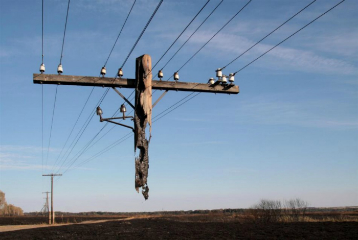

# Some stunning images that prove the world is beautiful without Photoshop

It is believed that hyperbolized reality happens only to filmmakers and photoshop masters. However, there are moments in life where they would be powerless. And in our review of  stunning images that show the beauty and irreality of our world without any photoshop.

- Goldfish

The largest carp in the world, caught in the south of France. It weighs 15 kg.

- Zigzag rails

Railroad tracks in New Zealand damaged by an earthquake.

- A pole floating in the air

The remains of a pole that did not burn during a fire in the Volgograd region.

- Exotic animal

A real miracle of nature - a cross between a zebra and a pony.

## Amazing lost treasures that people are still trying to find

There have been many priceless artifacts in human history that have been lost or disappeared under mysterious circumstances. Some have popped up on the black market, others are in private collections, and some may have been lost forever. But scholars and treasure hunters have not given up hope of ever finding these amazing objects.

- The Wright Brothers patents

Many of the most expensive and rare documents are kept in the U.S. National Archives. However, the archive's high level of security has not stopped thieves from stealing some priceless works of art. Thieves stole patent documents detailing Wilbur and Orville Wright's concept of an airplane, which was not discovered until 2003.

The thefts from the National Archives became so common that a special team was formed to search for the missing artifacts. They managed to recover photographs taken by the astronauts during the moon landing and audio tapes of the Hindenburg disaster.

- Tanto Kunimitsu

Stealing items that are national treasures has become a problem not only in the United States. According to the Cultural Affairs Agency in Japan, 109 priceless artifacts have gone missing from the Agency as well as from private collectors in the country. The list of missing treasures includes 52 swords, 17 sculptures and 10 paintings. The report says they were either stolen or changed owners, who are currently unknown. A 13th century tanto sword called "Kunimitsu" is also among the missing. Its previous owner died and the agency has not been notified as to who got the sword.

- City of Paichiti

Many legends surround the lost city of Paichiti. As the legends say, this is where the ancient Incas hid all their gold and treasure from marauding Europeans. Because of its location and relative obscurity, the town gradually became synonymous with the legendary El Dorado. Both places eventually became the epitome of the dream of any treasure seeker who believes they can find endless riches. Explorers have searched the jungles of Peru, where they have found many clues about the hidden treasure. But it is still unknown whether the Paititi is legend or reality.

